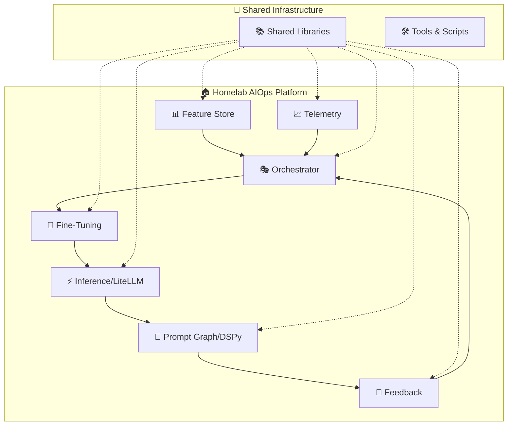

# 🏠🤖 Homelab AIOps Platform

> **Unified Edge AI Operations Platform** - From data ingestion to model deployment, monitoring, and feedback loops - all orchestrated through a single, powerful monorepo.

[](https://opensource.org/licenses/MIT)
[](https://www.python.org/downloads/)
[](https://nx.dev/)

---

## 🎯 Vision

**Stop fighting fragmented AI toolchains.** Homelab AIOps unifies the entire ML lifecycle—from data versioning to edge inference—in a cohesive, Jetson-optimized platform that scales from your homelab to production fleets.

### 🎪 What Makes This Special?

- 🔄 **End-to-End ML Lifecycle** - Data → Training → Deployment → Monitoring → Feedback
- 🚀 **Edge-First Design** - Optimized for NVIDIA Jetson Orin with sub-200ms inference
- 🧩 **Modular Architecture** - Swap backends, validators, or reward functions without breaking pipelines
- 📊 **Built-in Observability** - Comprehensive telemetry, tracing, and monitoring out-of-the-box
- 🔁 **Automated Feedback Loops** - Human-in-the-loop training with automatic retraining triggers

---

## 🏗️ Architecture Overview



---

## 🚀 Quick Start

### 📋 Prerequisites

Ensure you have these essentials installed:

- 🐍 **Python 3.11+** with `pyenv` for version management
- 📦 **Node.js 20+** and `pnpm` (`npm install -g pnpm`)
- 🔧 **GNU Make** (pre-installed on Linux/macOS, use WSL on Windows)
- 🐳 **Docker** (for containerization and deployment)
- 🎯 **Git** (for version control)

### ⚡ One-Command Setup

```bash
# Clone and setup the entire platform
git clone https://github.com/SPRIME01/homelab-aiops.git
cd homelab-aiops
make setup
```

🎉 **That's it!** The setup command automatically:
- 🔧 Initializes the Nx workspace with Python plugins
- 🐍 Sets up Python virtual environment with `pyenv` and `uv`
- 📝 Installs pre-commit hooks for code quality
- 🧩 Configures custom generators for consistent project structure

---

## 🎮 Daily Operations

### 🆕 Creating New Components

```bash
# Generate a new AI application
make app NAME=model-evaluator

# Generate a shared library
make lib NAME=inference-utils
```

### 🏃‍♂️ Development Workflow

```bash
# Lint all affected projects
make lint

# Type-check with mypy
make typecheck

# Run tests for changed code
make test

# Build affected projects
make build

# Serve a specific application locally
make serve PROJECT=inference
```

### 🔍 Project Visualization

```bash
# Open interactive dependency graph
make graph
```

---

## 🏗️ Platform Components

### 📊 **Feature Store** (`apps/feature-store`)
- 🗄️ Data ingestion and versioning
- 🔄 ETL pipeline management
- 📈 Feature engineering and validation
- 🔐 Data encryption and compliance

### 🎭 **Orchestrator** (`apps/orchestrator`)
- 🔄 Pipeline coordination and scheduling
- 📋 Workflow management with ZenML integration
- 📊 MLFlow experiment tracking
- 🚨 Event-driven retraining triggers

### 🎯 **Fine-Tuning** (`apps/fine-tuning`)
- 🚀 LlamaFactory integration for model training
- 📊 Experiment tracking and model comparison
- 🏆 Automated model evaluation and selection
- 📦 Model registry integration

### ⚡ **Inference** (`apps/inference/liteLLM`)
- 🔀 LiteLLM routing to multiple backends
- 🏥 Health checks and automatic failover
- 📝 OpenAI-compatible API endpoints
- ⚡ Sub-200ms edge inference on Jetson

### 🧠 **Prompt Graph** (`apps/prompt-graph/dspy`)
- 🎯 DSPy prompt optimization
- 📊 A/B testing for prompt performance
- 🔄 Iterative improvement cycles
- 📈 Performance tracking and analytics

### 💬 **Feedback** (`apps/feedback`)
- 👥 Human-in-the-loop feedback collection
- 🔄 A/B testing interface
- 📊 Preference learning and RLHF
- 🔔 Automatic retraining triggers

### 📈 **Telemetry** (`apps/telemetry`)
- 📊 Prometheus metrics collection
- 📝 Loki log aggregation
- 🔍 Jaeger distributed tracing
- 📊 Grafana dashboards

---

## 🚀 Infrastructure & Deployment

### 🏗️ Infrastructure as Code

```bash
# Plan infrastructure changes
make infra-plan TARGET=jetson-cluster

# Apply infrastructure
make infra-apply TARGET=jetson-cluster

# Run Ansible playbooks
make ansible-run PLAYBOOK=setup-jetson HOSTS=edge-nodes
```

### 🐳 Containerization

```bash
# Build Docker image for any service
make containerize PROJECT=inference

# Deploy to Kubernetes
make deploy-k8s-dev PROJECT=inference
```

---

## 🎯 Key Features

### 🔄 **Automated ML Lifecycle**
- 📊 **Data Versioning** with DVC integration
- 🎯 **Model Training** via ZenML pipelines
- 📈 **Experiment Tracking** with MLFlow
- 🚀 **Auto-Deployment** of best models
- 📊 **Continuous Monitoring** and feedback

### ⚡ **Edge-Optimized Inference**
- 🎯 **Jetson Optimization** with TensorRT quantization
- 🔀 **Smart Routing** via LiteLLM
- 🏥 **Health Monitoring** with automatic failover
- 📊 **Performance Tracking** (p95 < 200ms target)

### 🧠 **Intelligent Prompt Engineering**
- 🎯 **DSPy Integration** for prompt optimization
- 📊 **A/B Testing** for prompt comparison
- 🔄 **Iterative Improvement** cycles
- 📈 **Performance Analytics** and tracking

### 💬 **Human-in-the-Loop Learning**
- 👥 **Feedback Collection** interfaces
- 🏆 **Preference Learning** systems
- 🔄 **RLHF Integration** pipelines
- 🚨 **Auto-Retraining** triggers

---

## 🛠️ Development Tools

### 🐍 **Python Toolchain**
- **pyenv** - Python version management
- **uv** - Lightning-fast dependency resolution
- **ruff** - High-performance linting and formatting
- **mypy** - Static type checking
- **pytest** - Comprehensive testing framework

### 🔧 **Monorepo Management**
- **Nx** - Smart build system with dependency tracking
- **pnpm** - Efficient package management
- **Make** - Simple, powerful task orchestration
- **Pre-commit** - Automated code quality checks

---

## 📊 Monitoring & Observability

### 📈 **Metrics & Dashboards**
- 📊 **Prometheus** - Metrics collection and alerting
- 📊 **Grafana** - Beautiful, interactive dashboards
- 📝 **Loki** - Log aggregation and search
- 🔍 **Jaeger** - Distributed tracing

### 🚨 **Alerting & SLAs**
- ⚡ **Inference Latency** - p95 < 200ms
- 🏥 **Service Uptime** - 99.5% availability
- 🔔 **Pipeline Failures** - Slack notifications
- 📊 **Performance Degradation** - Automated alerts

---

## 🔒 Security & Compliance

### 🛡️ **Security Features**
- 🔐 **Vault Integration** - Centralized secrets management
- 🌐 **Tailscale Mesh** - Secure network isolation
- 🔑 **TLS Everywhere** - End-to-end encryption
- 👥 **RBAC** - Role-based access control

### 📝 **Compliance**
- 🚫 **No PII** in training data
- 🔒 **Data Encryption** at rest and in transit
- 📊 **Audit Logging** for all operations
- 🔍 **Traceability** for every model and dataset

---

## 🎯 Implementation Roadmap

| Priority | Feature | Status |
|----------|---------|--------|
| 🔥 **High** | Core Nx monorepo with apps | ✅ Complete |
| 🔥 **High** | Orchestrator + fine-tuning | 🚧 In Progress |
| 🔥 **High** | LiteLLM inference with health checks | 📋 Planned |
| 🔶 **Medium** | Feature store + data versioning | 📋 Planned |
| 🔶 **Medium** | DSPy prompt optimization | 📋 Planned |
| 🔶 **Medium** | Telemetry and monitoring | 📋 Planned |
| 🔵 **Low** | Multi-cluster ArgoCD | 🔮 Future |
| 🔵 **Low** | Advanced RLHF pipelines | 🔮 Future |

---

## 🤝 Contributing

We welcome contributions! Please see our [Contributing Guide](CONTRIBUTING.md) for details.

### 🧹 Cleanup & Maintenance

```bash
# Clean all build artifacts and caches
make clean

# Reinstall everything
make setup
```

---

## 📄 License

This project is licensed under the MIT License - see the [LICENSE](LICENSE) file for details.

---

## 🙏 Acknowledgments

- 🧠 **Nx Team** - For the amazing monorepo tooling
- 🐍 **Python Community** - For the incredible ecosystem
- 🤖 **AI/ML Community** - For pushing the boundaries of what's possible
- 🏠 **Homelab Community** - For inspiring self-hosted innovation

---

<div align="center">

**Built with ❤️ for the AI-Native Future**

[Documentation](docs/) • [Issues](issues/) • [Discussions](discussions/)

</div>
